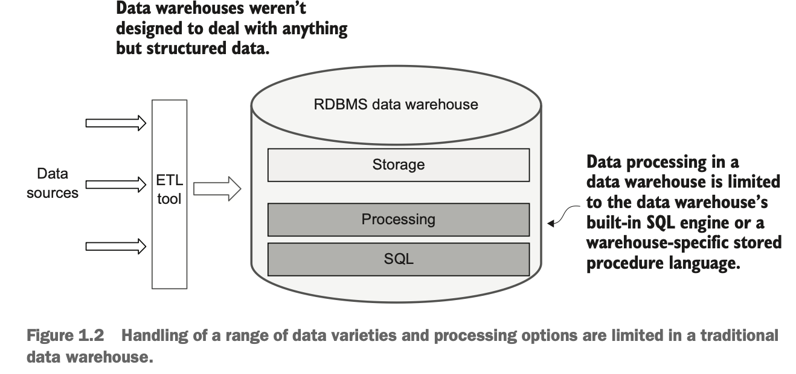
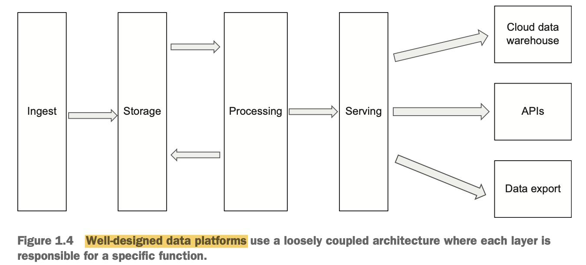
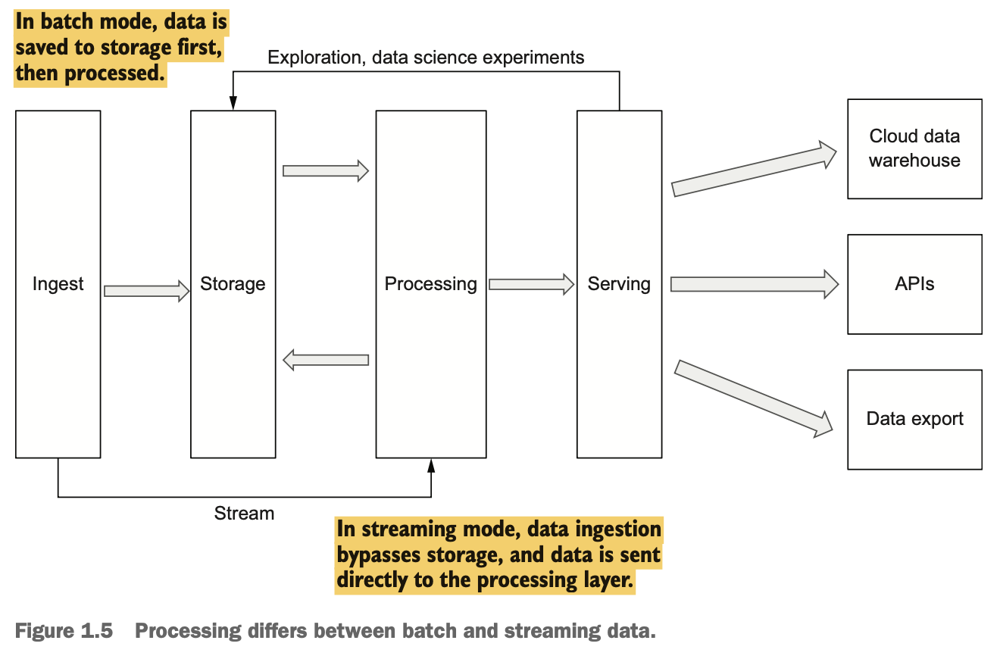
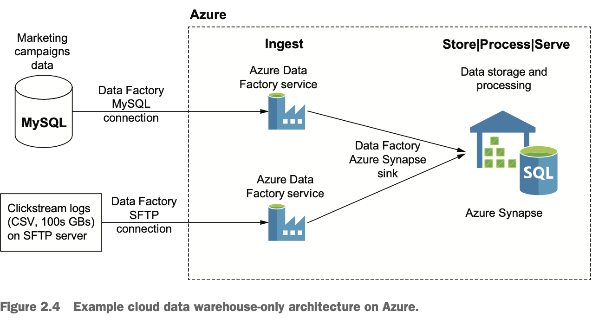
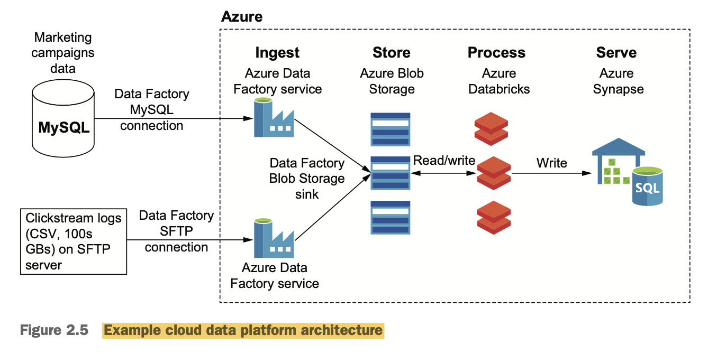

## chapter 1

*The trends behind the change from data warehouses to data platforms*

- Saas and other systems produce a variety of data types beyond the structured data found in traditional data warehouses, including semistructured and unstructured data. These last two data types are notoriously data warehouse unfriendly,
- Another and arguably more significant trend, however, is the change of applica- tion architecture from monolithic to microservices. Since in the microservices world there is no central operation database from which to pull data.
- There’s also growing pressure from business users and data scientists who use mod- ern analytics tools that can require access to raw data not typically stored in data ware- houses. This growing demand for self-service access to data also puts stresses on the rigid data models associated with traditional data warehouses.

*Data warehouses struggle with data variety, volume, and velocity*

- the challenges associated with today’s data: variety, volume, and velocity.

- **Variety**: We can have different unstructured data like unstructured data such as text, audio, and video.
    1. JSON file format as a popular way to exchange data between systems. While this format provides a lot of flexibility, it comes with a tendency to change schemas often and without warning—making it only semistructured.
    2. Data warehouses weren’t designed to deal with any- thing but structured data, and even then, they aren’t flexible enough to adapt to the frequent schema changes in structured data.
    

    3. ML models often take hours or even days to run. They also impact warehouse performance for all other users while they’re running.
    4. So we need to find a way to give data scientists access to high-volume, high-variety data will allow you to cap- italize on the promise of advanced analytics while reducing its impact on other users and, if done correctly, it can keep costs lower.

**Data lake**:
- A storage repository that holds a vast amount of raw data in its native format until it is needed.
- *Gartner definition*: A collection of storage instances of various data assets additional to the originating data sources. These assets are stored in a near-exact (or even exact) copy of the source format. As a result, the data lake is an unintegrated, non-subject-oriented collection of data

**Variety**: 
- Hadoop’s ability to do schema on read (versus the data warehouse’s schema on write) meant that any file in any format could be immediately stored on the system, and processing could take place later. 
- Unlike data warehouses, where processing could only be done on the structured data in the data ware- house, processing in Hadoop could be done on any data type

**Volume**:

**Velocity**:

- Hadoop’s ability to cost-effectively store and process huge amounts of data in its native format was a step in the right direction towards handing variety, volume, and velocity of today’s data estate, and for almost a decade, it was the de facto standard for data lakes in the data center.
- But Hadoop did have shortcomings:
    1. Complex system
    2. Storage and compute are not separate, So scaling is difficult.

- AWS EMR allows you to store data on AWS S3 and process the data on an AWS EMR cluster without permanently storing any data on AWS EMR machines. This unlocks a lot of flexibility in the number of clusters you can run and their configuration and allows you to create ephemeral clusters that can be disposed of once their job is done.

### The emergence of cloud data platforms:
- A data lake easily and cost-effectively handles an almost unlimited variety, volume, and velocity of data. The caveat is that it’s not usually organized in a way that’s useful to most users—business users in particular. Much of the data in a data lake is also **ungoverned**.
- data lake is almost always coupled with a data warehouse. The data warehouse serves as the primary governed data consumption point for business users.
- while direct user access to the largely ungoverned data in a data lake is typically reserved for data exploration either by advanced users, such as data scientists, or other systems.

**Ingestion layer**:

-  ingestion layer is that this layer should not modify and transform incoming data in any way. This is to make sure that the raw, unprocessed data is always available in the lake for data lin- eage tracking and reprocessing.

**Storage layer**:

- This is where data lake storage comes into play. An important characteristic of a data lake storage system is that it must be scalable and inexpensive, so as to accommodate the vast amounts and velocity of data being produced today.

**Processing layer**:
Several data processing frameworks have been developed that combine scalability with support for modern programming languages and integrate well into the overall cloud paradigm. Most notable among these are
1. Apache Spark
2. Apache Beam
3. Apache Flink

- Processing data in the data platform typically includes several distinct steps includ- ing schema management, data validation, data cleaning, and the production of data products.

**Serving layer**: 

- To provide data lake access to other applications, you can load data from the lake
into a fast key/value or document store and point the application to that. And for data science and engineering teams, a cloud data lake provides an environment where they can work with the data directly in cloud storage by using a processing framework such as Spark, Beam, or Flink.

- Some cloud vendors also support managed notebook environments such as Jupyter Notebook or Apache Zeppelin.

**Two more V’s**:
- Veracity and value are two other V’s that should factor into your choice of a data plat- form over just a data warehouse.
- The beauty of a data lake is that you can now give people access to more data. The downside, though, is that you’re also providing access to data that’s not necessarily as clean and organized and well governed as it tends to be in a data warehouse.

## Chapter 2

**An example cloud data warehouse–only architecture**

- Azure Data Factory is a fully managed PaaS ETL service that allows you to create pipe- lines by connecting to various data sources, ingesting data, performing basic transfor- mations such as uncompressing files or changing file formats, and loading data into a target system for processing and serving.

**An example cloud data platform architecture**

